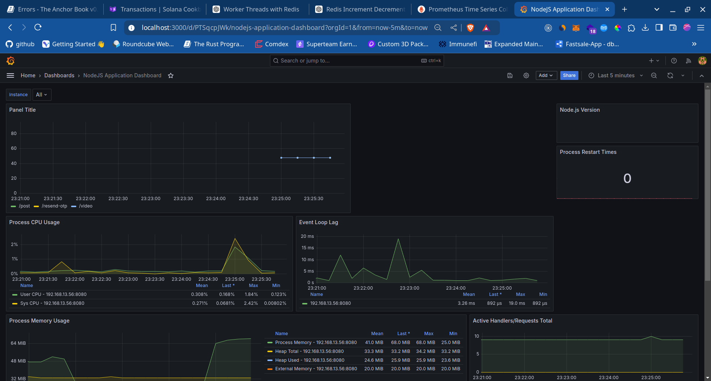
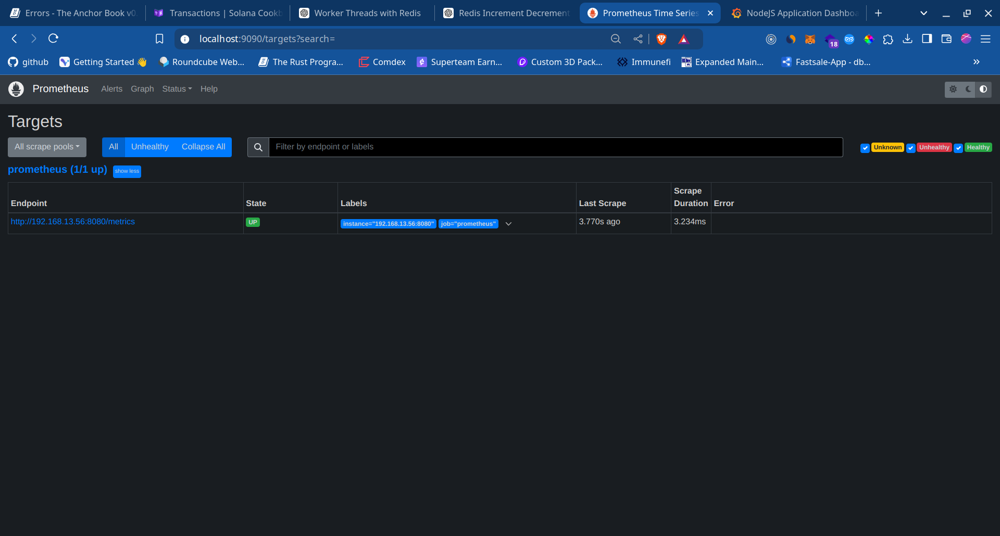

# Node Js Server


## Overview

This **Node.js** server is architected for scalability and high performance, utilizing a combination of clustering, threading, and task queuing. It is designed to efficiently handle concurrent requests and manage CPU-intensive tasks while ensuring system health through monitoring tools.

## Grafana Dashboard Preview



## Prometheus Preview



## Working


## Features

1. **Express Server with Middleware Integration**:
   - **CORS**: Configurable CORS support using `corsOptions`, allowing secure cross-origin resource sharing.
   - **Cookie Parsing**: Integration of `cookieParser` to manage cookies, enabling session management and user authentication.
   - **JSON and URL Encoding**: Supports JSON payloads with size limits and URL-encoded data to handle form submissions and API requests.
   - **Logging**: Utilizes `morgan` for HTTP request logging in development mode, providing detailed insights into API usage.

2. **Task Queue with Redis**:
   - **Task Management**: Uses Redis as a task queue to handle background jobs efficiently, ensuring that time-consuming tasks do not block the main event loop.
   - **Worker Threads**: Implements worker threads that process tasks asynchronously, improving throughput and responsiveness.

3. **Clustering for Scalability**:
   - **Multi-Core Utilization**: The server is designed to run on multiple CPU cores using Node.js clusters, which fork child processes to handle requests concurrently.
   - **Automatic Failover**: If a worker process crashes, the cluster manager automatically respawns it, ensuring continuous availability.

4. **Server Monitoring with Prometheus and Grafana**:
   - **Metrics Collection**: Prometheus collects various server metrics, including request/response times, status codes, and resource usage.
   - **Histogram Metrics**: A custom `Histogram` metric tracks the time taken by each request, categorized by method, route, and status code.
   - **Real-Time Monitoring**: Metrics are exposed at the `/metrics` endpoint, allowing Prometheus to scrape data and Grafana to visualize it in real time.

5. **Docker Integration**:
   - **Containerized Deployment**: The entire stack, including the Node.js server, Redis, Prometheus, and Grafana, is containerized using Docker, simplifying deployment and scaling.
   - **Docker Compose**: Uses Docker Compose for easy orchestration of multi-container applications, ensuring all services work seamlessly together.

## Installation

### Prerequisites

- **Node.js**: v14.x or higher
- **npm**: v6.x or higher
- **Docker**: Optional, for containerized deployment

### Clone the Repository

```bash
git clone https://github.com/mo-amir-code/scalable-nodejs-server.git
cd scalable-nodejs-server
```
### Install dependencies

```bash
npm install
```
This command install all the required dependencies of this project.

#### Set up .env
Check required environments variable in .env.example file.

#### Set up prometheus-config.yml 
Change <IP-ADDRESS<dsfd>> to  your computer IP address in this file.


### Build

```bash
npm run build
```
This command compiles TypeScript code into JavaScript.

### Watch

```bash
npm run watch
```
Start the TypeScript to JavaScript conversion in real time.

### Prometheus

```bash
docker compose up
```
To run the Prometheus and its config at PORT 9090.

### Grafana

```bash
docker run -d -p 3000:3000 --name=grafana grafana/grafana-oss
```
To run and get server metrics in the form visual.

### Development

```bash

npm run dev
```
To start development nodejs server.

### Production

```bash

npm run start
```
To start production nodejs server.